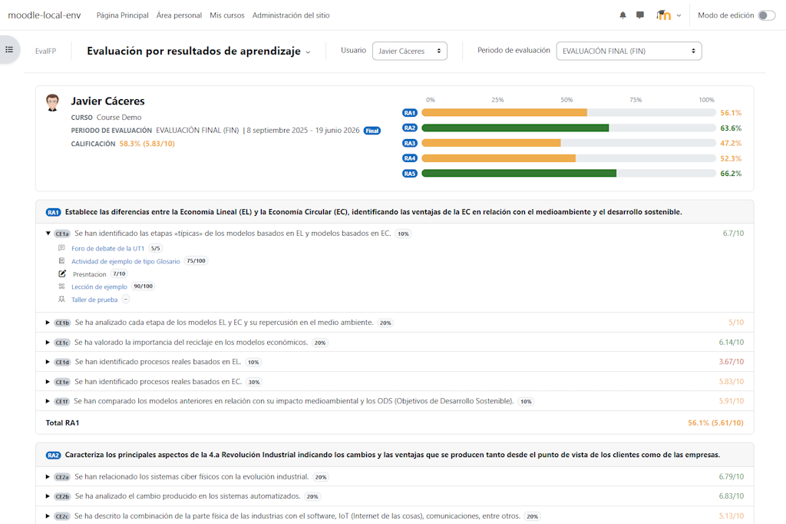
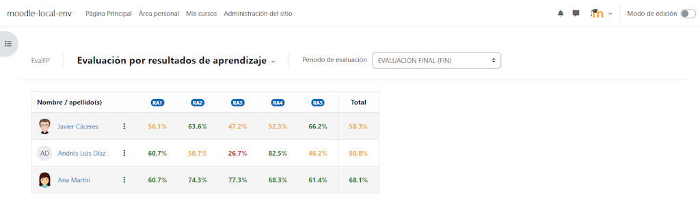
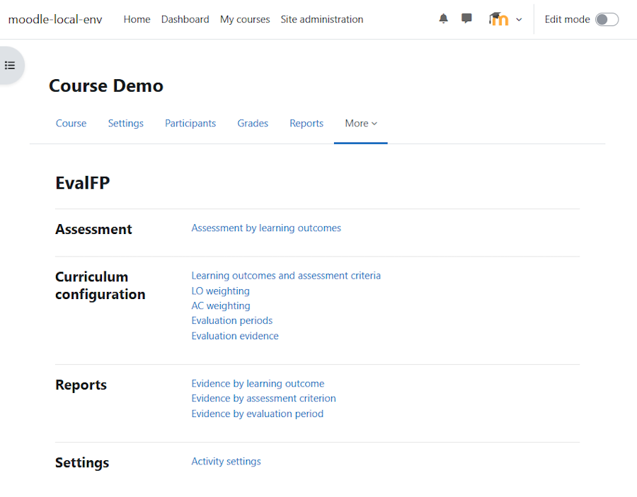
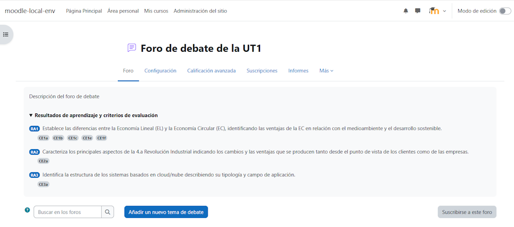

# EvalFP

EvalFP is a Moodle local plugin for Formación Profesional (FP), Spain's vocational education and training system.

It adds a curriculum-based assessment layer to Moodle courses, connecting Moodle gradebook items with learning outcomes, assessment criteria, evaluation periods and evidence reports.

The plugin is designed for Spanish vocational education workflows where teachers assess using Resultados de Aprendizaje (RA) and Criterios de Evaluación (CE), while keeping Moodle as the source of activities, grade items and grades.

In the English interface, EvalFP uses:

- `LO`: learning outcome, equivalent to RA in Spanish.
- `AC`: assessment criterion, equivalent to CE in Spanish.
- `Evidence`: a Moodle gradebook item linked to one or more assessment criteria.

## Purpose

Moodle already provides a powerful gradebook. Teachers can grade assignments, quizzes, manual items, categories and calculated items with a lot of flexibility.

EvalFP does not replace that gradebook. It gives Moodle grades additional curriculum context based on:

- which learning outcomes are defined in the course.
- which assessment criteria belong to each learning outcome.
- which Moodle gradebook items are used as assessment evidence.
- which evaluation period each evidence item belongs to.
- how assessment criteria contribute to each learning outcome.
- how learning outcomes contribute to the evaluation grade.

The guiding idea is simple:

```text
Moodle gradebook -> activities, grade items and grades.
EvalFP -> FP curriculum structure, evidence links, weights, periods and reports.
```

This can help teachers reduce parallel spreadsheets or external tools while keeping the assessment process inside Moodle.



## Main features

* Define learning outcomes and assessment criteria per course.
* Import RA/CE structures from an ODS template.
* Configure learning outcome weights.
* Configure assessment criterion weights within every learning outcome.
* Define partial, final and extraordinary evaluation periods.
* Link Moodle gradebook items to evaluation periods and assessment criteria.
* Include EvalFP course configuration and evidence links in Moodle backup and restore.
* Review an assessment summary by learning outcome.
* Open individual user reports with the structure `LO > AC > evidence`.
* Review evidence grouped by learning outcome, assessment criterion or evaluation period.
* Optionally display linked RA/CE information inside Moodle activity pages.

## Plugin information

| Item              | Value                                                         |
| ----------------- | ------------------------------------------------------------- |
| Plugin type       | Local plugin                                                  |
| Moodle component  | `local_evalfp`                                                |
| Installation path | `local/evalfp`                                                |
| Compatibility     | Moodle 4.5 LTS or later                                       |
| Main scope        | Formación Profesional, Spanish VET, Spain                     |
| Assessment focus  | Learning outcomes, assessment criteria and evaluation periods |
| License           | GNU GPL v3 or later                                           |

## Languages

EvalFP is primarily designed for use in Spanish, as its natural context is Formación Profesional in Spain.

The plugin also includes an English translation to support review and reuse by the wider Moodle community.

Additional languages can be added using Moodle's standard language file system.

## What EvalFP does not do

EvalFP does not create a parallel grading system and does not modify how Moodle activities are graded.

It reads Moodle gradebook data and interprets it through the configured FP curriculum structure. Moodle remains the source of grades, grade items, activity grading settings and gradebook scales.

EvalFP is also not a substitute for the official teaching plan of a department. Each school, department and teaching team remains responsible for applying its approved regulations and assessment criteria.

## Requirements

* Moodle 4.5 LTS or later.
* A course with Moodle gradebook items or gradable activities.
* Users with course editing permissions to configure EvalFP.

## Installation

Copy the plugin folder to:

```text
local/evalfp
```

Then complete the installation using one of the standard Moodle methods.

From the command line:

```bash
php admin/cli/upgrade.php
```

Or from the Moodle web interface:

```text
Site administration > Notifications
```

If needed, purge Moodle caches:

```bash
php admin/cli/purge_caches.php
```

## Permissions

EvalFP defines the following course capability:

```text
local/evalfp:useincourse
```

By default, it is allowed for:

* editing teachers;
* managers.

Users without this capability cannot manage EvalFP in a course.

Some assessment pages also require Moodle gradebook permissions, especially:

```text
moodle/grade:viewall
```

## Recommended workflow

1. Define or import learning outcomes and assessment criteria.
2. Configure learning outcome weights.
3. Configure assessment criterion weights within each learning outcome.
4. Create the evaluation periods used in the course.
5. Link Moodle gradebook items as assessment evidence.
6. Review the course assessment summary.
7. Review individual user reports and evidence reports.



## Course navigation

EvalFP is accessed from the course navigation, under the course `More` menu.



The plugin is organised into four main areas:

* Assessment: assessment summary and individual user reports.
* Curriculum configuration: learning outcomes, assessment criteria, weights, evaluation periods and evidence links.
* Reports: read-only evidence reports grouped by learning outcome, assessment criterion or evaluation period.
* Settings: course-level display options.

## Basic use

A typical EvalFP course setup starts by defining or importing the learning outcomes and assessment criteria for the module.

Teachers then configure the weight of each learning outcome and the weight of each assessment criterion inside its corresponding learning outcome.

After that, evaluation periods are created and Moodle gradebook items are linked as assessment evidence. Each evidence item can be assigned to an evaluation period and linked to one or more assessment criteria.

Once the configuration is complete, teachers can review course-level summaries, individual user reports and evidence reports.

## Backup and restore

EvalFP supports Moodle backup and restore for course-level curriculum configuration, course settings, evaluation periods and evidence links.

Activity-level evidence links are included when the corresponding Moodle activity and grade item are restored.

After complex restores, teachers should review the evidence matrix to confirm that Moodle restored the expected activities and grade items.

## Activity information

EvalFP can optionally display linked curriculum information inside supported Moodle activity pages.

When enabled, the activity page displays the linked learning outcomes and assessment criteria as read-only curriculum context.

EvalFP course-module controls are shown only for Moodle activity modules. Resource modules are intentionally excluded because they are not assessment evidence by themselves.



This does not change grading, does not modify the Moodle gradebook and does not allow editing evidence links from the activity view.

## Calculation model

EvalFP uses Moodle gradebook grades as the source data.

The calculation follows these general rules:

* Moodle grade values are normalised internally to a 0-100 scale.
* Displayed evidence grades keep their original Moodle scale, for example `80/100` or `6/10`.
* An evidence item linked to an assessment criterion but without a user grade counts as `0`.
* An assessment criterion with no linked evidence in the selected evaluation period is displayed but does not penalise the learning outcome result.
* Learning outcome results are calculated from the weighted assessment criteria with available evidence.
* Evaluation grades are calculated from the weighted learning outcomes with available results.

This means that unassessed criteria do not unfairly penalise the result, while assigned evidence without a grade does count as `0` because it represents assessment evidence that exists for that period.

## Visual thresholds

EvalFP uses the same achievement thresholds across the plugin:

* success: 60% or higher;
* warning: 40% or higher;
* danger: below 40%;
* no data: dash.

These colours are only visual indicators. They do not change Moodle grades.

## Data and privacy

EvalFP stores course-level curriculum configuration and links between Moodle gradebook items and the FP curriculum structure.

This includes learning outcomes, assessment criteria, their weights, evaluation periods, evidence links and course-level display settings.

The plugin does not store independent user grades. It reads grade information from Moodle's gradebook.

Individual reports are generated from Moodle users and Moodle gradebook data already present in the course.

## License

This plugin is licensed under the GNU General Public License v3 or later.

See: [http://www.gnu.org/copyleft/gpl.html](http://www.gnu.org/copyleft/gpl.html)

## Author

Created and maintained by Javier Caceres Gonzalez ([javiercaceresgonzalez@gmail.com](mailto:javiercaceresgonzalez@gmail.com)).

EvalFP stems from a personal experience in teaching vocational courses for the Spanish Formación Profesional system, as a response to a real need identified through the daily use of Moodle: a clear, integrated and coherent way to connect course grades with learning outcomes, assessment criteria and evaluation periods.

For years, this need has led many teachers to complement Moodle with spreadsheets or external tools in order to organise, interpret and justify assessment according to the curriculum model used in vocational education. EvalFP aims to reduce that dependency, avoid duplicated work and make better use of the information already available in Moodle's gradebook.

The project also has an important personal dimension. After many years working with Moodle, I felt the need and curiosity to understand its internal architecture more deeply, as well as the proper way to develop integrated solutions within the platform.

EvalFP is a personal project developed over a long time in short and discontinuous periods, due to professional and teaching responsibilities. It has been a constant learning process, involving documentation review, Moodle development standards, best practices and examples shared by the Moodle community.

Throughout the development process of EvalFP, each decision has been questioned and reviewed with the aim of building a useful, maintainable tool that respects Moodle's philosophy. EvalFP does not try to replace the gradebook, but to complement it with a curriculum layer adapted to the reality of assessment in Spanish Formación Profesional.

This plugin is shared as an open contribution to both the educational community and the Moodle community, with the hope that it may be useful to other teachers, schools and departments facing similar needs.
